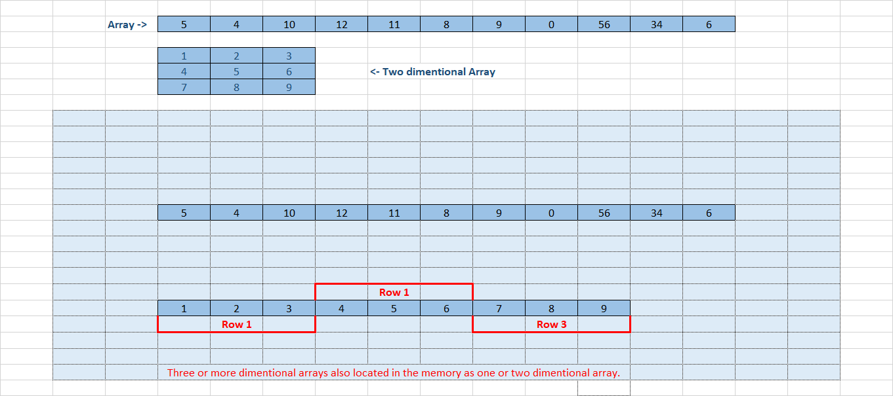

<h1 style="text-align: center;">Array</h1>

Properties of Array

    1. Arrays can store data of a specific type.
    2. Elements of an array in memory are located contigiously.
    3. Each element of an array has a unique index, which starts from 0.
    4. Size of array is predefined and can't be modified.

Types of Array

*  One dimentional array
<table style="text-align:center; border: 1px solid black;">
    <caption><h3>One dimentional array</h3></caption>
    <tr>
        <td style="border: 1px solid black;">1</td>
        <td style="border: 1px solid black;">2</td>
        <td style="border: 1px solid black;">3</td>
        <td style="border: 1px solid black;">4</td>
        <td style="border: 1px solid black;">5</td>
        <td style="border: 1px solid black;">6</td>
        <td style="border: 1px solid black;">7</td>
        <td style="border: 1px solid black;">8</td>
    </tr>
    <tr>
    <td style="border: 1px solid black; color:red;"><b>[0]</b></td>
    <td style="border: 1px solid black; color:red;"><b>[1]</b></td>
    <td style="border: 1px solid black; color:red;"><b>[2]</b></td>
    <td style="border: 1px solid black; color:red;"><b>[3]</b></td>
    <td style="border: 1px solid black; color:red;"><b>[4]</b></td>
    <td style="border: 1px solid black; color:red;"><b>[5]</b></td>
    <td style="border: 1px solid black; color:red;"><b>[6]</b></td>
    <td style="border: 1px solid black; color:red;"><b>[7]</b></td>
    </tr>
</table>

* Two dimentional array
<table style="text-align:center; border: 1px solid black;">
    <caption><h3>Two dimentional array</h3></caption>
    <tr>
    <td style="border: 1px solid black; color:red; border-top: hidden;border-left: hidden;">&nbsp; <!-- EMPTY --></td>
    <td style="border: 1px solid black; color:red;"><b>[0]</b></td>
    <td style="border: 1px solid black; color:red;"><b>[1]</b></td>
    <td style="border: 1px solid black; color:red;"><b>[2]</b></td>
    <td style="border: 1px solid black; color:red;"><b>[3]</b></td>
    <td style="border: 1px solid black; color:red;"><b>[4]</b></td>
    <td style="border: 1px solid black; color:red;"><b>[5]</b></td>
    <td style="border: 1px solid black; color:red;"><b>[6]</b></td>
    <td style="border: 1px solid black; color:red;"><b>[7]</b></td>
    </tr>
    <tr>
        <td style="border: 1px solid black; color:red;"><b>[0]</b></td>
        <td style="border: 1px solid black;">1</td>
        <td style="border: 1px solid black;">2</td>
        <td style="border: 1px solid black;">3</td>
        <td style="border: 1px solid black;">4</td>
        <td style="border: 1px solid black;">5</td>
        <td style="border: 1px solid black;">6</td>
        <td style="border: 1px solid black;">7</td>
        <td style="border: 1px solid black;">8</td>
    </tr>
    <tr>
        <td style="border: 1px solid black; color:red;"><b>[1]</b></td>
        <td style="border: 1px solid black;">9</td>
        <td style="border: 1px solid black;">10</td>
        <td style="border: 1px solid black;">11</td>
        <td style="border: 1px solid black;">12</td>
        <td style="border: 1px solid black;">13</td>
        <td style="border: 1px solid black;">14</td>
        <td style="border: 1px solid black;">15</td>
        <td style="border: 1px solid black;">16</td>
    </tr>
    <tr>
        <td style="border: 1px solid black; color:red;"><b>[2]</b></td>
        <td style="border: 1px solid black;">17</td>
        <td style="border: 1px solid black;">18</td>
        <td style="border: 1px solid black;">19</td>
        <td style="border: 1px solid black;">20</td>
        <td style="border: 1px solid black;">21</td>
        <td style="border: 1px solid black;">22</td>
        <td style="border: 1px solid black;">23</td>
        <td style="border: 1px solid black;">24</td>
    </tr>
</table>

Three dimentional array

    This is same as two dimentional array, with one extra dimention(hight, weight and depth).

Arrays in memory(contigious)

